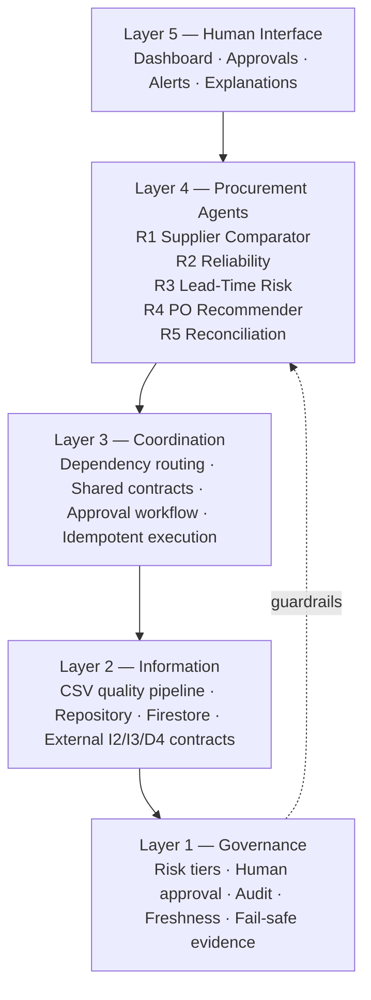
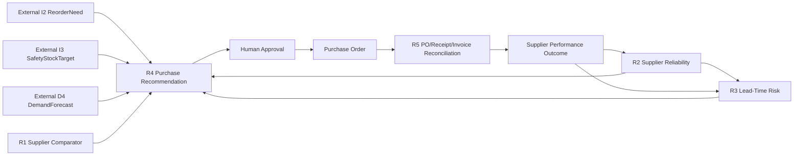
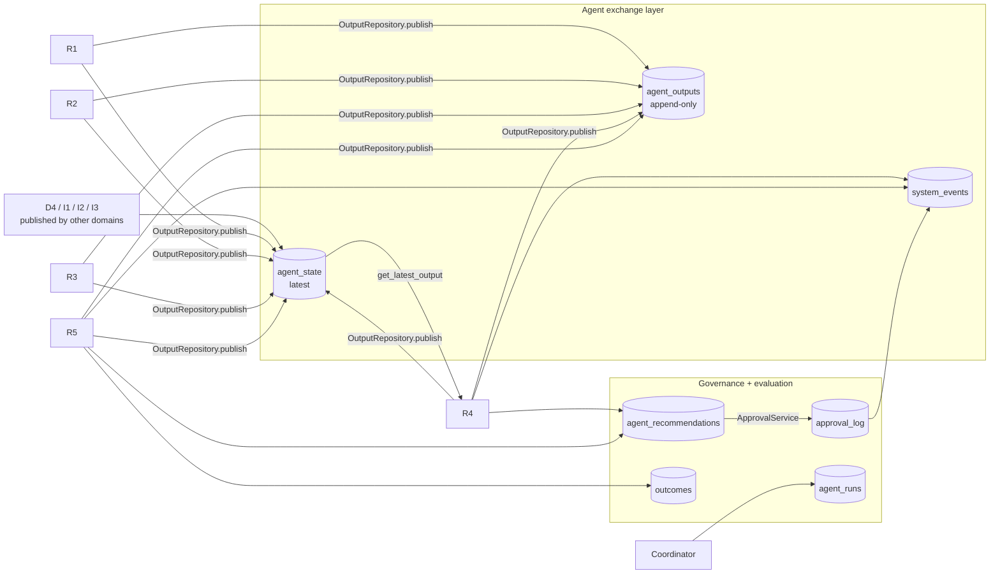

# Procurement Agent Architecture

## Boundary

This project owns only the Procurement domain (R1–R5). Demand, Inventory, Pricing and Customer Engagement are external systems. Cross-domain coupling occurs through typed contracts, never direct imports of another team's internal implementation.

## Five-layer architecture

## Agent dependency graph

## R1 scoring

R1 filters inactive suppliers and expired quotes first. It then scores active product offers using:

- quoted cost: 40%
- MOQ fit: 20%
- quoted lead time: 20%
- payment terms: 10%
- quantity coverage: 10%

Every candidate includes a score breakdown and warnings. The score is a ranking heuristic, not an autonomous purchasing decision.

## R2 reliability

R2 uses recency-weighted closed delivery outcomes:

- on-time delivery: 40%
- fill rate: 35%
- defect quality: 15%
- invoice accuracy: 10%

Sparse history produces a neutral prior and low confidence instead of false precision.

## R3 lead-time risk

R3 derives actual order-to-delivery days and reports median, mean, P90, robust variability and delay rate. A supplier is classified LOW/MEDIUM/HIGH risk using explicit thresholds. When historical delivery data is unavailable, R3 falls back to quoted lead time with a low-confidence guardrail.

## R4 recommendation

R4 requires valid, fresh I2, I3 and D4 contracts plus R1–R3 outputs. Missing or stale evidence returns a DRAFT `insufficient_evidence` result. Candidate decision score combines supplier ranking, reliability, lead-time risk and evidence confidence. Quantity respects the external reorder need and supplier MOQ. Every purchase recommendation requires human review.

## R5 reconciliation

R5 performs deterministic three-way matching across:

- approved purchase order,
- one or more goods receipts,
- one or more supplier invoices.

Checks include under/over-delivery, receipt-vs-invoice quantity mismatch, price variance, defective goods, late delivery and duplicate invoice numbers. A clean match is low risk; mismatches enter the approval queue before the PO can be closed.

## Outcome feedback

Closing an accepted R5 result writes a `supplier_performance` record and an
`outcomes` record referencing it, then emits `supplier.performance.updated` on
`system_events`. This closes the operational loop: future R2 and R3 evaluations
use actual delivery and invoice outcomes, and any other domain can react to the
event without a direct call into Procurement.

## Shared Firestore architecture

Procurement runs as one domain inside the shared 25-agent system. Its
persistence follows the shared layout exactly; see
`SHARED_FIREBASE_CONFORMANCE.md` for the full specification.

Every agent result passes through one `OutputRepository`, which builds the
`SharedAgentOutput` envelope, enforces the ownership boundary, writes the
immutable record and the latest projection atomically, and routes **action
contracts only** to `agent_recommendations`. Agents never write those
collections themselves. Every invocation leaves an `agent_runs` trace, and every
published output carries `input_refs` to the exact upstream records it consumed,
so a decision can be reconstructed from persisted data alone.

### Evidence vs action

- **R1–R3 are evidence contracts.** They inform R4 and live only in
  `agent_outputs`/`agent_state`. A MEDIUM/HIGH result raises
  `procurement.evidence.risk_elevated` on `system_events`; it never becomes a
  review item — nobody "approves" a measurement.
- **R4 is the Procurement action recommendation.** Its `PurchaseRecommendation`
  is the one commercial decision, routed to `agent_recommendations` and gated
  by human approval before a purchase order exists.
- **R5 is reconciliation/exception evidence.** A clean match closes the PO
  directly. A mismatch raises `procurement.exception.created` and, separately,
  a `ReconciliationReview` action — only that resulting human action becomes a
  recommendation, and only its approval permits closure.

### Audit is composed, not stored

There is no audit collection. `system_events` carries triggers only. The Audit
API and UI build the trail on read from `agent_runs`, `agent_outputs`,
`agent_recommendations`, `approval_log`, `system_events` and `outcomes`.

### Standalone development fixtures

The D4/I1/I2/I3 fixtures and import endpoints that publish upstream contracts
are **DEV/TEST COMPATIBILITY ONLY**, gated by `ALLOW_UPSTREAM_FIXTURES`. In the
shared system that flag is false: Demand and Inventory are the sole producers
and Procurement only reads their latest valid state.

## Explainability

The UI/API exposes rationale, top input contracts, confidence, risk, rule version, guardrails and approval status. It does not expose hidden chain-of-thought.
