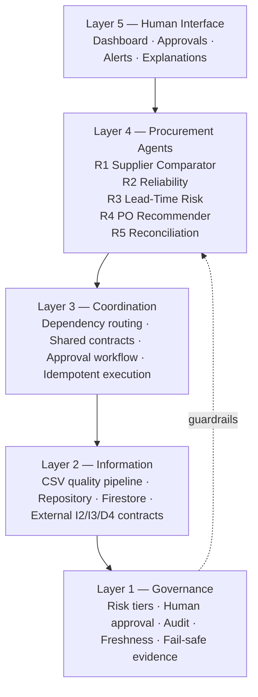
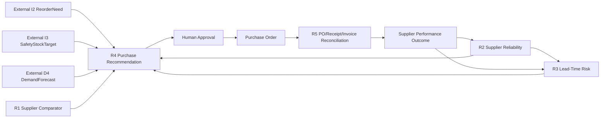

# Retail Procurement Agent (R1–R5) — Complete Project Documentation
This consolidated file is included at the project root for direct access. The original individual documents remain in `docs/`.

---

# Project Overview

# Retail Procurement Agent — Agent 4 (R1–R5)

A complete, standalone implementation of **Agent 4: Procurement** for the supplied five-layer Agentic AI retail architecture. The project intentionally implements only Procurement and exposes stable contracts for the external Demand and Inventory teams.

## Scope

| Agent | Purpose | Primary output |
|---|---|---|
| R1 | Supplier Comparator | `SupplierComparison` |
| R2 | Supplier Reliability | `SupplierReliabilityScore` |
| R3 | Lead-Time Risk | `LeadTimeRisk` |
| R4 | Purchase Order Recommender | `PurchaseRecommendation` |
| R5 | Delivery & Invoice Reconciliation | `ProcurementException` / match result |

The implementation keeps the document's design principles: specialized agents, lightweight coordination, human approval for high-impact procurement actions, auditable decisions, deterministic/statistical methods before unnecessary LLM use, and safe failure when evidence is missing or stale.

## Five-layer mapping

1. **Governance:** approval states, risk tiers, audit events, fail-safe evidence checks, optional second review threshold.
2. **Information:** Firestore/in-memory repository adapters, CSV validation/import, supplier/quote/performance/PO/receipt/invoice data.
3. **Coordination:** `ProcurementCoordinator` routes R1→R2/R3→R4 and R5 workflows without embedding domain algorithms.
4. **Agent:** five independent R1–R5 Python components with typed outputs.
5. **Human Interface:** React + Vite + Tailwind procurement dashboard for supplier intelligence, recommendations, approvals, POs, reconciliation, imports and audit.

## External integration contracts

This repository **does not implement Demand or Inventory agents**. It accepts their published outputs:

- `I2 / ReorderNeed`
- `I3 / SafetyStockTarget`
- `D4 / DemandForecast`

R4 validates those contracts and refuses to issue a recommendation when required evidence is absent or stale.

## Quick start — backend

```bash
cd backend
python -m venv .venv
# Windows: .venv\Scripts\activate
# macOS/Linux: source .venv/bin/activate
pip install -r requirements.txt
pytest -q
uvicorn app.main:app --reload --port 8000
```

The in-memory development profile automatically loads `sample_data/`.

- API: `http://localhost:8000/api/v1`
- Swagger: `http://localhost:8000/docs`
- Health: `http://localhost:8000/api/v1/health`

## Quick start — frontend

```bash
cd frontend
cp .env.example .env
npm install
npm run dev
```

Open `http://localhost:5173`. Development defaults to demo authentication. Staging uses Firebase Authentication.

## Demonstration flow

1. Open **Recommendations** and run `SKU-100`.
2. R1 ranks active suppliers; R2/R3 evaluate every candidate; R4 produces a governed purchase recommendation.
3. Approve the R4 recommendation.
4. Execute it to create a purchase order.
5. Add/import goods receipt and invoice records.
6. Run R5 reconciliation from **Purchase Orders**.
7. Accept a clean or reviewed reconciliation and close the PO.
8. Closing the PO writes a new supplier-performance outcome so future R2/R3 scores use the actual result.

Seed data also contains:

- `PO-DEMO-001`: clean three-way match.
- `PO-DEMO-002`: under-delivery, price variance, defects and late delivery.

## Human-in-the-loop rule

R4 never creates a purchase order by itself. It generates `READY_FOR_REVIEW`; a manager must approve/modify it, then explicitly execute it. R5 mismatches also require review. Clean R5 matches may pass automatically because they are low-risk deterministic validation results, not commercial actions.

## Repository layout

```text
retail-procurement-agent/
├── backend/
│   ├── app/
│   │   ├── agents/procurement/     # R1–R5
│   │   ├── contracts/              # Shared + external contracts
│   │   ├── coordination/           # Routing, approvals, execution
│   │   ├── governance/             # Risk/approval/fail-safe policy
│   │   ├── data/                   # Memory + Firestore repositories
│   │   ├── services/               # Analytics, imports, quality, audit
│   │   └── api/                    # FastAPI routes
│   └── tests/
├── frontend/                       # React + Vite + Tailwind
├── firebase/                       # Auth-backed Firestore/Storage/Hosting rules
├── sample_data/                    # Deterministic staging/demo fixtures
├── docs/
├── .github/workflows/              # CI + staging deployment
└── docker-compose.yml
```

## Tests

```bash
cd backend
pytest -q
```

The suite covers contracts, every procurement agent, stale/missing evidence, API behavior, governance, approval/execution, R5 reconciliation and full recommendation→PO→receipt/invoice→reconciliation→close feedback.

See `docs/TESTING.md` and `docs/VALIDATION_REPORT.md` for evidence.

## Staging target

- **Frontend:** Firebase Hosting
- **Authentication:** Firebase Authentication
- **Operational DB:** Cloud Firestore
- **Storage/rules:** Firebase Storage
- **Backend:** FastAPI on Google Cloud Run
- **Scheduled jobs:** Cloud Scheduler/Cloud Run trigger if required
- **CI/CD:** GitHub Actions

See `docs/STAGING_DEPLOYMENT.md` for exact configuration and acceptance checks.


---

# Architecture

# Procurement Agent Architecture

## Boundary

This project owns only the Procurement domain (R1–R5). Demand, Inventory, Pricing and Customer Engagement are external systems. Cross-domain coupling occurs through typed contracts, never direct imports of another team's internal implementation.

## Five-layer architecture



## Agent dependency graph



## R1 scoring

R1 filters inactive suppliers and expired quotes first. It then scores active product offers using:

- quoted cost: 40%
- MOQ fit: 20%
- quoted lead time: 20%
- payment terms: 10%
- quantity coverage: 10%

Every candidate includes a score breakdown and warnings. The score is a ranking heuristic, not an autonomous purchasing decision.

## R2 reliability

R2 uses recency-weighted closed delivery outcomes:

- on-time delivery: 40%
- fill rate: 35%
- defect quality: 15%
- invoice accuracy: 10%

Sparse history produces a neutral prior and low confidence instead of false precision.

## R3 lead-time risk

R3 derives actual order-to-delivery days and reports median, mean, P90, robust variability and delay rate. A supplier is classified LOW/MEDIUM/HIGH risk using explicit thresholds. When historical delivery data is unavailable, R3 falls back to quoted lead time with a low-confidence guardrail.

## R4 recommendation

R4 requires valid, fresh I2, I3 and D4 contracts plus R1–R3 outputs. Missing or stale evidence returns a DRAFT `insufficient_evidence` result. Candidate decision score combines supplier ranking, reliability, lead-time risk and evidence confidence. Quantity respects the external reorder need and supplier MOQ. Every purchase recommendation requires human review.

## R5 reconciliation

R5 performs deterministic three-way matching across:

- approved purchase order,
- one or more goods receipts,
- one or more supplier invoices.

Checks include under/over-delivery, receipt-vs-invoice quantity mismatch, price variance, defective goods, late delivery and duplicate invoice numbers. A clean match is low risk; mismatches enter the approval queue before the PO can be closed.

## Outcome feedback

Closing an accepted R5 result writes a `supplier_performance` record. This closes the operational loop: future R2 and R3 evaluations use actual delivery and invoice outcomes.

## Explainability

The UI/API exposes rationale, top input contracts, confidence, risk, rule version, guardrails and approval status. It does not expose hidden chain-of-thought.


---

# API Reference

# API Surface

Base: `/api/v1`

## System

- `GET /health`
- `GET /ready`
- `GET /me`
- `GET /dashboard`
- `GET /audit`

## Agents

- `GET /agents/status`
- `POST /agents/{R1|R2|R3|R4|R5}/run`
- `POST /procurement/recommend/{product_id}` — orchestrates R1, R2, R3 and R4
- `POST /procurement/reconcile/{po_id}` — runs R5
- `POST /procurement/close/{po_id}/{reconciliation_id}` — closes accepted reconciliation and writes supplier performance feedback

## Recommendations and approval

- `GET /recommendations?agent_id=&status=&risk=`
- `GET /recommendations/{id}`
- `POST /recommendations/{id}/decision`
- `POST /recommendations/{id}/execute` — creates PO only for approved/modified R4 recommendations

Decision body:

```json
{
  "decision": "APPROVED",
  "reason": "Stock risk confirmed"
}
```

For `MODIFIED`, add `modified_action`.

## Data

- `GET /data/{collection}`
- `PUT /data/{collection}`
- `POST /imports/{collection}` multipart CSV

Operational collections (Procurement is the canonical writer):

- suppliers
- supplier_quotes
- supplier_performance
- purchase_orders
- goods_receipts
- invoices

Upstream contract imports (published into `agent_outputs` + `agent_state` on
the owning agent's behalf): demand_forecasts (D4), inventory_positions (I1),
reorder_needs (I2), safety_stock_targets (I3).

Shared exchange layer: `GET /outputs/{output_type}/{entity_id}`,
`GET /outputs/{output_type}/{entity_id}/history`, `GET /runs/{run_id}`,
`GET /audit` (system_events). `PUT /data/*` refuses every exchange/governance
collection. Canonical reference: `API.md`; architecture: `SHARED_FIREBASE_CONFORMANCE.md`.

## Supplier intelligence

- `GET /suppliers/{supplier_id}/scorecard` — runs R2 and R3 and returns current supplier profile.


---

# Integration Contracts

# External Integration Contracts

Procurement consumes external outputs through stable schemas in `backend/app/contracts/models.py`.

## I2 — ReorderNeed

Required fields:

```json
{
  "product_id": "SKU-100",
  "reorder_point": 180,
  "projected_position": 95,
  "reorder_needed": true,
  "recommended_qty": 260,
  "generated_at": "2026-09-08T10:00:00Z",
  "source_version": "inventory-1.0"
}
```

## I3 — SafetyStockTarget

```json
{
  "product_id": "SKU-100",
  "safety_stock": 120,
  "service_level": 0.95,
  "lead_time_days": 5,
  "generated_at": "2026-09-08T10:00:00Z",
  "source_version": "inventory-1.0"
}
```

## D4 — DemandForecast

```json
{
  "product_id": "SKU-100",
  "horizon_days": 7,
  "expected_qty": 310,
  "lower_bound": 270,
  "upper_bound": 355,
  "confidence": 0.86,
  "drivers": ["weekend uplift", "local event"],
  "generated_at": "2026-09-08T10:00:00Z",
  "source_version": "demand-1.0"
}
```

## Freshness rule

R4 currently rejects I2/I3/D4 evidence older than 72 hours. This threshold is deliberately visible and test-covered so integration teams can agree a different SLA without changing agent internals.

## Producer/consumer rule

The other teams should publish contract records into the shared repository or call the Procurement API import/upsert endpoints. Procurement must not import their agent classes or depend on their internal model code.


---

# Team Handoff

# Procurement Team Handoff

This repository owns **only Agent 4 / Procurement**.

## What the Procurement developer owns

- R1 Supplier Comparator
- R2 Supplier Reliability
- R3 Lead-Time Risk
- R4 Purchase Order Recommender
- R5 Delivery & Invoice Reconciliation
- Procurement API, dashboard, approvals, audit, tests and staging configuration

## What Procurement does not own

- Demand implementation (D1–D5)
- Inventory implementation (I1–I5)
- Pricing implementation (P1–P5)
- Customer Engagement implementation (C1–C5)

## Required upstream contracts

Other developers only need to publish valid records for:

- `ReorderNeed` (I2)
- `SafetyStockTarget` (I3)
- `DemandForecast` (D4)

See `INTEGRATION_CONTRACTS.md` for exact fields.

## Outputs for other domains / shared platform

Procurement publishes:

- `SupplierComparison` (R1)
- `SupplierReliabilityScore` (R2)
- `LeadTimeRisk` (R3)
- `PurchaseRecommendation` (R4)
- `ProcurementException` plus actual close/performance facts (R5)

Approved R4 results create purchase orders only after explicit manager execution. R5 close writes supplier-performance facts that can be shared with Inventory exception handling if the full system is integrated later.

## Integration rule

Do not import another team's agent classes. Integrate through the Pydantic contract schemas / persisted contract records / API boundaries only. Contract changes should be coordinated and CI-tested before merge.


---

# Testing and Acceptance

# Testing and Acceptance Plan

## Automated backend suite

Run:

```bash
cd backend
pytest -q
```

Coverage areas:

1. Pydantic contract validation.
2. R1 supplier ranking and no-quote fail-safe.
3. R2 good-vs-poor supplier differentiation and neutral prior.
4. R3 robust lead-time metrics and quoted fallback.
5. R4 purchase recommendation, no-reorder path and stale dependency fail-safe.
6. R5 clean match, mismatch matrix and missing evidence.
7. Recommendation approval, explicit PO execution and idempotency.
8. Full feedback loop: recommend → approve → execute → receive → invoice → reconcile → close → supplier performance.
9. HTTP health, agent status, recommendation/approval and dashboard endpoints.
10. Authorization boundaries: missing/non-bearer/invalid credentials, demo-header
    spoofing, and manager-role enforcement.
11. Governance boundaries: execution blocked before approval, rejected
    recommendations blocked, duplicate-execution safety, modification
    auditability, actor/timestamp on audit events.

12. Malformed-record resilience (19 tests): schema-less supplier and quote
    documents are screened out with reasons instead of failing the comparison.
13. Shared Firebase architecture (62 tests): envelope, append-only outputs,
    latest state, ownership, run trace, events, outcomes, idempotency, trace
    reconstruction; evidence-vs-action routing (R1–R3 never create approval
    records at any risk; R5 clean vs mismatch review action); audit composed on
    read from six canonical sources; DEV/TEST-only upstream fixture gates.
14. Firebase emulator integration (68 tests, auto-skipped unless the emulators
    are running): real Firestore adapter CRUD, real security rules (including
    backend-only protected collections), real emulator-issued ID tokens under
    `AUTH_MODE=firebase`, governance under those tokens, lifecycle persistence,
    Storage upload and rules, malformed-document resilience, the shared
    end-to-end trace, failure behavior.

Current result: **125 passed / 68 skipped** without emulators; **193 passed** with
them. See `TESTING.md` for how to start the emulator container.

## Minimum acceptance scenarios

### Scenario A — purchase recommendation

`SKU-100` must produce an R4 `PurchaseRecommendation` in `READY_FOR_REVIEW`, with supplier, quantity, expected cost, confidence, risk, evidence and rationale.

### Scenario B — no purchase required

`SKU-200` must return `NoPurchaseRequired` without creating a PO.

### Scenario C — clean reconciliation

`PO-DEMO-001` must return `MATCH` with no exception.

### Scenario D — exception reconciliation

`PO-DEMO-002` must detect at least under-delivery, price variance, defective goods and late delivery and place the result into human review.

### Scenario E — stale evidence

An I2/I3/D4 record older than the freshness window must cause R4 to return DRAFT with `insufficient_evidence` rather than a confident recommendation.

## Frontend validation

The frontend has an automated Vitest suite (jsdom + `@testing-library/react`):

```bash
cd frontend
npm ci
npm run test -- --run
```

Current result: **51 passed, 0 failed, 0 skipped** across `src/api.test.js` (10),
`src/components/Badge.test.js` (14) and `src/App.test.js` (27). CI runs
`npm ci` → tests → `npm run build`, in that order.

See `TESTING.md` for the per-file coverage table. Browser acceptance additionally
verifies:

- Dashboard metrics
- Supplier R2/R3 scorecard
- R4 generation
- Approve/reject
- PO creation only after approval
- R5 clean and exception flows
- CSV import errors
- Audit trail
- responsive layout and empty/error states

The browser regression itself runs under the demo authentication profile.
Firebase authentication is covered separately and at the API level, against the
Auth emulator with `AUTH_MODE=firebase` — real ID tokens, role custom claims, and
rejection of missing, malformed and non-bearer credentials. See the Firebase
section of `VALIDATION_REPORT.md`. Firebase login through the browser UI remains
a staging acceptance item.


---

# Validation Report

**Canonical source: [`VALIDATION_REPORT.md`](VALIDATION_REPORT.md).** It is not
reproduced here — an earlier duplicated copy drifted out of date, so this bundle
now points at the single authoritative document instead.

Summary as of 2026-09-09:

| Item | State |
|---|---|
| Backend suite | **PASSED** — 193 passed with emulators (125 core + 68 Firebase); 125 passed / 68 skipped without |
| Frontend suite | **PASSED** — 51 passed, 0 failed, 0 skipped |
| Vite production build | **PASSED** |
| Live browser regression | **PASSED** — dashboard → supplier intelligence → R4 → approval → PO creation → R5 clean → R5 mismatch → audit |
| Authorization & governance boundaries | **PASSED** — 21 tests under demo auth, 4 more under real Firebase tokens |
| Docker build / compose | **PASSED — EXECUTION VALIDATED** — both images built, stack ran, containerized smoke workflow passed |
| Firebase emulator, Firestore adapter, security rules, Auth, Storage | **PASSED — LOCAL EMULATOR VALIDATED** — 68 tests |
| R1 malformed-record handling | **FOUND → FIXED → REGRESSION VERIFIED** — 19 focused tests + 2 emulator-backed, mutation-checked |
| Shared Firebase architecture | **CONFORMANT — DATABASE-READY** — 35 conformance tests + emulator e2e trace; see `SHARED_FIREBASE_CONFORMANCE.md` |

Read `VALIDATION_REPORT.md` for the executed evidence, the defects found while
closing the Docker and Firebase gaps, and the two items deliberately left
unchanged; and [`MERGE_READINESS_REPORT.md`](MERGE_READINESS_REPORT.md) for the
submission decision.

## Staging status

The repository is **staging-deployment ready**, not already deployed, and no
deployment was performed or triggered. Actual Firebase/Google Cloud staging
requires the project owner's Firebase/GCP project, authentication configuration
and GitHub secrets. The exact checklist is in `STAGING_DEPLOYMENT.md`.


---

# Staging Deployment

# Staging Deployment

The deployment follows the supplied stack: React/Vite/Tailwind, FastAPI/Python, Firebase Authentication + Firestore + Storage, Google Cloud background/deployment services and GitHub Actions.

## Target topology

- Firebase Authentication — manager/admin access
- Cloud Firestore — operational records and recommendation/audit state
- Firebase Storage — restricted import/evidence files
- Cloud Run — FastAPI backend
- Firebase Hosting — React frontend
- GitHub Actions — CI and manual staging deployment
- Cloud Scheduler — optional scheduled supplier-score refresh or reconciliation scan

## Prerequisites

1. Google Cloud/Firebase project.
2. Firestore enabled in Native mode.
3. Firebase Authentication Email/Password provider enabled.
4. Firebase Storage enabled.
5. Artifact Registry repository named `procurement`.
6. Cloud Run, Cloud Build and Artifact Registry APIs enabled.
7. GitHub workload identity federation or equivalent service-account authentication.

## Backend environment

Set Cloud Run:

```text
APP_ENV=staging
AUTH_MODE=firebase
REPOSITORY_BACKEND=firestore
FIREBASE_PROJECT_ID=<project-id>
CORS_ORIGINS=https://<firebase-hosting-domain>
MAX_PO_VALUE_WITHOUT_SECOND_REVIEW=25000
```

Cloud Run should use a service account with least-privilege Firestore access. Prefer workload identity; do not commit service-account JSON.

## Firebase user role

The Firestore rules expect an authenticated token custom claim `role` equal to one of:

- `admin`
- `owner_manager`
- `procurement_manager`

The backend uses the same claim for protected procurement actions.

## GitHub secrets

Required by `.github/workflows/deploy-staging.yml`:

```text
GCP_WORKLOAD_IDENTITY_PROVIDER
GCP_SERVICE_ACCOUNT
GCP_PROJECT_ID
GCP_REGION
STAGING_WEB_ORIGIN
VITE_FIREBASE_API_KEY
VITE_FIREBASE_AUTH_DOMAIN
VITE_FIREBASE_STORAGE_BUCKET
VITE_FIREBASE_APP_ID
FIREBASE_TOKEN
```

For long-lived production use, replace `FIREBASE_TOKEN` with a service-account/OIDC-based Firebase deployment approach.

## First staging load

Use authenticated CSV imports or an admin-only bootstrap process to load suppliers, quotes, supplier performance and external I2/I3/D4 fixtures. Do not expose `/demo/bootstrap` to untrusted users; it remains manager-protected and should be disabled or removed in production hardening if unnecessary.

## Staging acceptance checklist

1. `/api/v1/health` is 200.
2. `/api/v1/ready` reports Firestore.
3. Firebase unauthenticated users cannot access protected endpoints/data.
4. R1 ranks valid supplier quotes and ignores expired offers.
5. R2/R3 scorecards reflect supplier history.
6. R4 returns `READY_FOR_REVIEW` for a genuine reorder.
7. R4 refuses stale or missing I2/I3/D4 data.
8. Manager approves R4; PO creation is impossible before approval.
9. Repeated execute requests do not create duplicate POs.
10. R5 clean match closes successfully.
11. R5 mismatch requires review.
12. PO close creates supplier performance feedback.
13. Audit events contain manager identity and linked record IDs.
14. Frontend build is served by Firebase Hosting and works at mobile/desktop widths.
15. CI is green before staging is declared complete.

